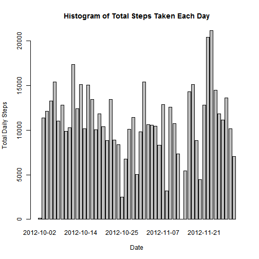
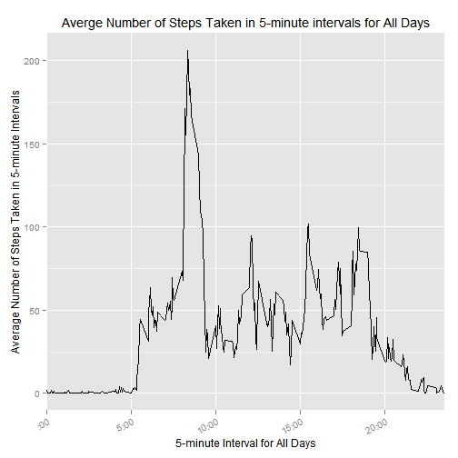
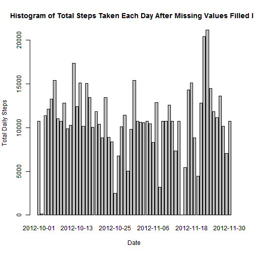
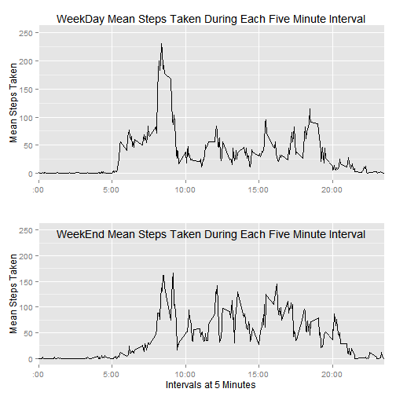

## Reproducible Research: Peer Assessment 1  
#### PART 1 of 5: Loading and preprocessing the data
##### 1. Show any code that is needed to Load the data (i.e. read.csv()) &
##### 2. Process/transform the data (if necessary) into a format suitable for your analysis


```r
# used:  {r setup, echo=TRUE, fig.width=6, fig.height=8}
library(ggplot2)  # for ggplot function etc.
library(plyr)  # for ddply function
options("scipen"=6)  # do not use scientific notation below 6 zeros.

zip.file.here=file.exists("activity.zip")
cvs.file.here=file.exists("activity.csv")
# if the file has not already been downloaded, load zip file and unzip
if(cvs.file.here){
      print("'activity.csv' file is in the current R working directory:")
      getwd()
}else if(zip.file.here){
      unzip("activity.zip")
      print("Unzipping 'activity.zip' file to working directory:")
      getwd()
}else{
      print("*** ERROR - cannot locate 'activity.zip' or 'activity.csv' data file!")
}
```

```
## [1] "'activity.csv' file is in the current R working directory:"
```

```
## [1] "C:/Users/andy/github/datasciencecoursera/ReproducableResearch"
```

```r
# read.csv the dataset is stored in a comma-separated-value (CSV) file 
activity <- read.csv("activity.csv")  # 17568 obs. & 3 var.
v1 <- activity[1]
v2 <- activity[2]
v3 <- activity[3]
```

The Data File has 17568 observations and 3 variables with names: steps, date, interval

There are 2304 missing values in the data as follows:  
steps has 2304 missing values  
date has 0 missing values  
interval has 0 missing values  


#### PART 2 of 5: What is mean total number of steps taken per day?
##### 1. Make a histogram of the total number of steps taken each day

```r
#barplot(total_daily_steps$steps, names.arg =total_daily_steps$date, #xlab = "Date",ylab="Total Daily Steps", main="Number of Steps per Day")

# use only complete observations i.e. drop all NA observations
stepsComplete <- activity[complete.cases(activity),]  # 15264 obs. & 3 var.
# aggregating by date
stepsDateSum <- ddply(stepsComplete, .(date), summarize, 
                      freqDate=length(date),  totalSteps=sum(steps))
total_daily_steps <- aggregate(steps ~ date, activity, sum, na.rm=TRUE)
# Make histogram of the total steps taken each day
barplot(stepsDateSum$totalSteps, names.arg=stepsDateSum$date, 
        xlab="Date", ylab="Total Daily Steps",
        main="Histogram of Total Steps Taken Each Day")
```

 

##### 2. Calculate and report the mean and median total number of steps taken per day

```r
mean.daily.steps <- round(mean(stepsDateSum$totalSteps),1)
mean.daily.steps
```

```
## [1] 10766
```
#####The mean steps (with missing values ignored) per day is 10766.2


```r
median.daily.steps <- median(stepsDateSum$totalSteps)
median.daily.steps
```

```
## [1] 10765
```
#####The median steps (with missing values ignored) per day is 10765  


#### PART 3 of 5: What is the average daily activity pattern?
##### 1. Make a time series plot (i.e. type = "l") of the 5-minute interval (x-axis) and the average number of steps taken, averaged across all days (y-axis)


```r
# get only "interval" & "steps" for all observations i.e. ignore "date"
intervalSteps <- stepsComplete[,c("interval","steps")]
stepsAverage <- ddply(intervalSteps,.(interval),summarize,
                   averageSteps=mean(steps),totalSteps=sum(steps))
ggplot(stepsAverage, aes(x=interval,y=averageSteps)) + geom_line() +
      labs(y=expression("Average Number of Steps Taken in 5-minute Intervals"))+
      labs(x=expression("5-minute Interval for All Days")) +
      scale_x_discrete(breaks = c("0","500","1000","1500","2000"),                                 
                       labels=c(":00","5:00","10:00","15:00","20:00")) +
      labs(title=expression(paste("Averge Number of Steps Taken in ", 
                                  "5-minute intervals for All Days",sep=""))) +
      theme(axis.text.x=element_text(angle=25, hjust=1,vjust=1))
```

 


##### 2. Which 5-minute interval, on average across all the days in the dataset, contains the maximum number of steps?


```r
maxStepsIndex <- which.max(stepsAverage[,2])
stepsAverage$interval[maxStepsIndex]
```

```
## [1] 835
```

The maximum number of steps in a 5-minute interval (averaged across all day)  
is in the interval: 835


#### PART 4 of 5: Imputing missing values
##### 1. Calculate and report the total number of missing values in the dataset (i.e. the total number of rows with NAs)


```r
naRows <- sum(is.na(activity))
sum(is.na(activity))
```

```
## [1] 2304
```

##### The total number of missing values in 'activities.csv' is: 2304

##### 2. Devise a strategy for filling in all of the missing values in the dataset. The strategy does not need to be sophisticated. For example, you could use the mean/median for that day, or the mean for that 5-minute interval, etc.

######My strategy for filling in all of the missing values in the dataset is to use the mean value of steps for the interval when a missing value is found. See code below:


```r
# fill in all missing values in the dataset
addedMeans <- ddply(activity,.(interval),transform,
              intervalMeanSteps=round(mean(steps,na.rm=TRUE),0))
for (i in 1:nrow(addedMeans)){
      if (is.na(addedMeans$steps[i])){
            addedMeans$steps[i] <- addedMeans$intervalMeanSteps[i]
      }
}
```

##### 3. Create a new dataset that is equal to the original dataset but with the missing data filled in.


```r
activityNOna <- addedMeans[,c("steps","date","interval")]
```

##### 4. Make a histogram of the total number of steps taken each day and Calculate and report the mean and median total number of steps taken per day. Do these values differ from the estimates from the first part of the assignment? What is the impact of imputing missing data on the estimates of the total daily number of steps?

######The mean and median total number of steps taken per day differ only slightly from the estimates from the first part. And the impact of imputing missing data on the estimates of the total daily number of steps is small at less than 1 part in 10,000 for the mean and at 3 parts in 10,000 for the median values between the dataset (one with NAs and one with NAs replaced).

The mean steps (with missing values ignored) per day is 10766.2  
The mean steps (with missing values filled in) per day is 10765.6

The median steps (with missing values ignored) per day is 10765  
The median steps (with missing values filled in) per day is 10762


```r
stepsDateSumNOna <- ddply(activityNOna,.(date),
                          summarize,totalSteps=sum(steps))
barplot(stepsDateSumNOna$totalSteps, names.arg=stepsDateSumNOna$date, 
        xlab="Date", ylab="Total Daily Steps",
        main="Histogram of Total Steps Taken Each Day After Missing Values Filled In")
```

 

```r
mean.daily.stepsNOna <- round(mean(stepsDateSumNOna$totalSteps),1)
mean.daily.stepsNOna
```

```
## [1] 10766
```
#####The mean steps (with missing values filled in) per day is 10765.6


```r
median.daily.stepsNOna <- median(stepsDateSumNOna$totalSteps)
median.daily.stepsNOna
```

```
## [1] 10762
```
#####The median steps (with missing values filled in) per day is 10762  


#### PART 5 of 5: Are there differences in activity patterns between weekdays and weekends?
##### 1. Create a new factor variable in the dataset with two levels - "weekday" and "weekend" indicating whether a given date is a weekday or weekend day.

```r
activityNOna$date <- strptime(as.character(activityNOna$date),"%Y-%m-%d")
activityNOna$dayType=ifelse(weekdays(activityNOna$date) %in% c("Saturday","Sunday"), "weekend", "weekday")
activityNOna$dayType <- as.factor(activityNOna$dayType)
str(activityNOna)
```

```
## 'data.frame':	17568 obs. of  4 variables:
##  $ steps   : num  2 0 0 47 0 0 0 2 0 34 ...
##  $ date    : POSIXlt, format: "2012-10-01" "2012-10-02" ...
##  $ interval: int  0 0 0 0 0 0 0 0 0 0 ...
##  $ dayType : Factor w/ 2 levels "weekday","weekend": 1 1 1 1 1 2 2 1 1 1 ...
```
##### 2. Make a panel plot containing a time series plot (i.e. type = "l") of the 5-minute interval (x-axis) and the average number of steps taken, averaged across all weekday days or weekend days (y-axis). The plot should look something like the following, which was creating using simulated data:

```r
intervalStepsDayType <- activityNOna[,c("interval","steps","dayType")]
stepsAverageDayType <- ddply(intervalStepsDayType,
                            c("interval","dayType"),summarize,
                            N=length(steps), 
                            meanSteps=mean(steps), 
                            sumSteps=sum(steps))
par(mfrow=c(2,1))
stepsWeekDay <- stepsAverageDayType[stepsAverageDayType$dayType=="weekday",]
stepsWeekEnd <- stepsAverageDayType[stepsAverageDayType$dayType=="weekend",]
require(gridExtra)
```

```
## Loading required package: gridExtra
## Loading required package: grid
```

```r
plot1 <- ggplot(stepsWeekDay, aes(x=interval,y=meanSteps)) +
      geom_line() + 
      #theme(axis.title.x = element_blank()) + 
      #xlab("Intervals at 5 Minutes)") +
      scale_x_discrete(breaks = c("0","500","1000","1500","2000"),                                 
                       labels=c(":00","5:00","10:00","15:00","20:00")) +
      xlab(NULL) +
      ylab("Mean Steps Taken") + 
      scale_y_continuous(limit = c(0, 250)) + 
      ggtitle("WeekDay Mean Steps Taken During Each Five Minute Interval")
plot2 <- ggplot(stepsWeekEnd, aes(x=interval,y=meanSteps)) + 
      geom_line() + 
      scale_x_discrete(breaks = c("0","500","1000","1500","2000"),                                 
                       labels=c(":00","5:00","10:00","15:00","20:00")) +
      xlab("Intervals at 5 Minutes") +
      ylab("Mean Steps Taken") + 
      scale_y_continuous(limit = c(0, 250)) + 
      ggtitle("WeekEnd Mean Steps Taken During Each Five Minute Interval") +
      theme(plot.title=element_text(vjust = -2.5))
grid.arrange(plot1, plot2, ncol=1)
```

 
